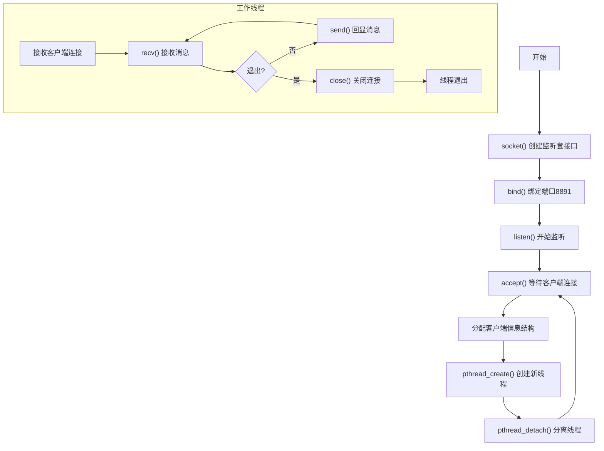

# 实验 1.5：多线程服务器

---

## 简要实验步骤

### 1. 环境准备

- 使用实验室 Linux 服务器（通过 SSH 远程连接）
- 安装编译工具：`sudo apt install build-essential`

### 2. 程序设计

**多线程服务器流程图：**



**多线程服务器伪代码：**

```
listen_fd = socket(AF_INET, SOCK_STREAM, 0)
bind(listen_fd, port=8891)
listen(listen_fd, backlog=10)

while (true):
    conn_fd = accept(listen_fd)  // 阻塞等待连接

    // 为每个客户端创建新线程
    client_info = {conn_fd, client_addr, client_id++}
    pthread_create(thread, handle_client, client_info)
    pthread_detach(thread)  // 分离线程，无需join

// 工作线程函数
function handle_client(client_info):
    send(welcome_message)
    while (true):
        data = recv(client_info.conn_fd)
        if data == "quit" or disconnected:
            break
        send(echo_response)
    close(client_info.conn_fd)
```

### 3. 编译运行

```bash
cd 1.5
make
./mt_server     # 终端1：启动多线程服务器
./mt_client     # 终端2：启动多客户端测试
```

---

## 实验结果

1. 成功实现多线程 TCP 服务器
2. 服务器能够同时处理多个客户端连接
3. 每个客户端由独立线程处理，互不干扰
4. 使用 `pthread_detach()` 实现线程自动回收
5. 使用互斥锁保护共享的客户端计数器

---

## 结果截图

> **（请在此处插入截图）**
>
> 截图要求：
>
> - 包含服务器处理多个客户端的运行结果
> - 包含本机 MAC 地址信息（使用 `ip link show | grep ether` 获取）
> - 以上内容需在同一张屏幕截图中

【截图位置预留】

---

## 问题总结

### 遇到的问题

| 问题                                             | 原因              | 解决方案                    |
| ------------------------------------------------ | ----------------- | --------------------------- |
| 编译报错 `undefined reference to pthread_create` | 未链接 pthread 库 | 编译时加 `-pthread` 选项    |
| 线程间数据竞争                                   | 共享变量未保护    | 使用 `pthread_mutex` 互斥锁 |

### 多线程 vs 单线程服务器

| 特性       | 单线程服务器         | 多线程服务器         |
| ---------- | -------------------- | -------------------- |
| 并发处理   | 串行，一次一个客户端 | 并行，同时多个客户端 |
| 实现复杂度 | 简单                 | 需要处理线程同步     |
| 资源消耗   | 低                   | 每个线程占用栈空间   |
| 适用场景   | 低并发               | 高并发               |

### 关键线程函数

| 函数                          | 说明                     |
| ----------------------------- | ------------------------ |
| `pthread_create()`            | 创建新线程               |
| `pthread_detach()`            | 分离线程，结束后自动回收 |
| `pthread_join()`              | 等待线程结束并回收       |
| `pthread_mutex_lock/unlock()` | 互斥锁，保护共享数据     |
