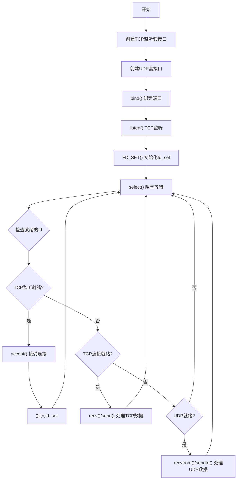

# 实验 1.6：多路 IO 用法

---

## 简要实验步骤

### 1. 环境准备

- 使用实验室 Linux 服务器（通过 SSH 远程连接）
- 安装编译工具：`sudo apt install build-essential`

### 2. 程序设计

**多路 IO 服务器流程图：**



**多路 IO 服务器伪代码：**

```
tcp_listen_fd = socket(SOCK_STREAM)
bind(tcp_listen_fd, TCP_PORT)
listen(tcp_listen_fd)

udp_fd = socket(SOCK_DGRAM)
bind(udp_fd, UDP_PORT)

FD_ZERO(all_fds)
FD_SET(tcp_listen_fd, all_fds)
FD_SET(udp_fd, all_fds)
max_fd = max(tcp_listen_fd, udp_fd)

while (true):
    read_fds = all_fds  // 复制，因为select会修改
    select(max_fd + 1, read_fds, NULL, NULL, NULL)  // 阻塞

    if FD_ISSET(tcp_listen_fd, read_fds):
        conn_fd = accept(tcp_listen_fd)
        FD_SET(conn_fd, all_fds)
        max_fd = max(max_fd, conn_fd)

    if FD_ISSET(tcp_conn_fd, read_fds):
        data = recv(tcp_conn_fd)
        send(tcp_conn_fd, echo_response)

    if FD_ISSET(udp_fd, read_fds):
        data, addr = recvfrom(udp_fd)
        sendto(udp_fd, echo_response, addr)
```

### 3. 编译运行

```bash
cd 1.6
make
./select_server     # 终端1：启动服务器
./select_client     # 终端2：启动客户端
```

### 4. 客户端命令

```
t:Hello     # 通过TCP发送 "Hello"
u:World     # 通过UDP发送 "World"
quit        # 退出
```

---

## 实验结果

1. 成功实现使用 select 的多路 IO 服务器
2. 服务器能够同时监听 TCP（端口 8892）和 UDP（端口 8893）
3. 客户端可以选择使用 TCP 或 UDP 与服务器通信
4. select 实现了单线程处理多个套接口的能力
5. 验证了 IO 多路复用的非阻塞并发特性

---

## 结果截图

> **（请在此处插入截图）**
>
> 截图要求：
>
> - 包含服务器同时处理 TCP 和 UDP 请求的结果
> - 包含本机 MAC 地址信息（使用 `ip link show | grep ether` 获取）
> - 以上内容需在同一张屏幕截图中

【截图位置预留】

---

## 问题总结

### 遇到的问题

| 问题                      | 原因                       | 解决方案                 |
| ------------------------- | -------------------------- | ------------------------ |
| select 返回后 fd_set 变化 | select 会修改传入的 fd_set | 每次调用前复制 fd_set    |
| max_fd 计算错误           | 新连接后未更新 max_fd      | 每次 accept 后检查并更新 |

### select vs 多线程

| 特性        | select 多路 IO          | 多线程                 |
| ----------- | ----------------------- | ---------------------- |
| 并发模型    | 单线程，事件驱动        | 多线程，每连接一线程   |
| 资源消耗    | 低（无线程开销）        | 高（每线程需要栈空间） |
| 编程复杂度  | 状态管理较复杂          | 相对直观               |
| fd 数量限制 | 通常 1024（FD_SETSIZE） | 受线程数限制           |
| 适用场景    | 大量连接但活跃度低      | 连接数少但处理复杂     |

### 关键函数说明

| 函数                                                  | 说明                 |
| ----------------------------------------------------- | -------------------- |
| `select(nfds, readfds, writefds, exceptfds, timeout)` | 等待多个 fd 就绪     |
| `FD_ZERO(set)`                                        | 清空 fd_set          |
| `FD_SET(fd, set)`                                     | 将 fd 加入集合       |
| `FD_CLR(fd, set)`                                     | 将 fd 从集合移除     |
| `FD_ISSET(fd, set)`                                   | 检查 fd 是否在集合中 |
