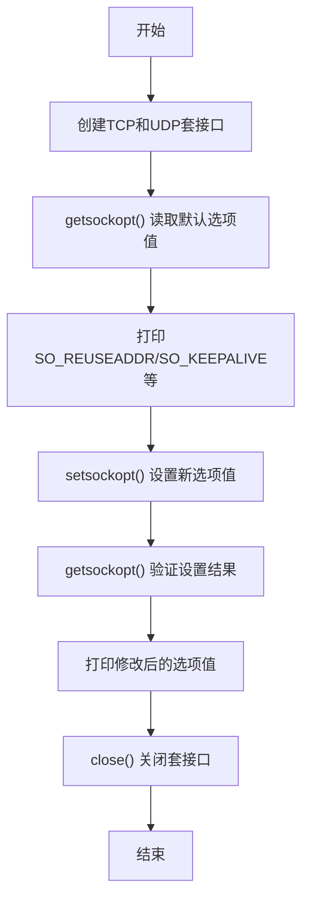
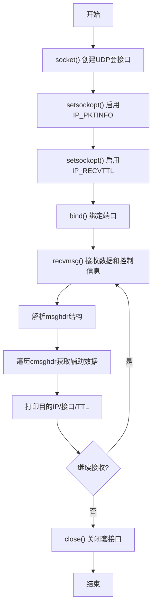

# 实验 1.4：高级套接口编程（选项和控制信息）

---

## 简要实验步骤

### 1. 环境准备

- 使用实验室 Linux 服务器（通过 SSH 远程连接）
- 安装编译工具：`sudo apt install build-essential net-tools netcat`

### 2. 程序设计

**套接口选项程序流程图：**



**套接口选项程序伪代码：**

```
tcp_fd = socket(AF_INET, SOCK_STREAM, 0)
udp_fd = socket(AF_INET, SOCK_DGRAM, 0)

// 读取选项
getsockopt(tcp_fd, SOL_SOCKET, SO_REUSEADDR, &value)
getsockopt(tcp_fd, SOL_SOCKET, SO_SNDBUF, &bufsize)

// 设置选项
setsockopt(tcp_fd, SOL_SOCKET, SO_REUSEADDR, 1)
setsockopt(tcp_fd, IPPROTO_TCP, TCP_NODELAY, 1)

// 验证并打印
getsockopt(tcp_fd, SOL_SOCKET, SO_REUSEADDR, &value)
print(value)

close(tcp_fd)
close(udp_fd)
```

**控制信息程序流程图：**



**控制信息程序伪代码：**

```
sockfd = socket(AF_INET, SOCK_DGRAM, 0)
setsockopt(sockfd, IPPROTO_IP, IP_PKTINFO, 1)  // 启用包信息
setsockopt(sockfd, IPPROTO_IP, IP_RECVTTL, 1)  // 启用TTL获取
bind(sockfd, port=8890)

while (true):
    msg = recvmsg(sockfd)  // 使用recvmsg而非recvfrom
    print(msg.data)

    // 遍历控制信息
    for cmsg in msg.control:
        if cmsg.type == IP_PKTINFO:
            print(cmsg.dest_ip, cmsg.interface)
        if cmsg.type == IP_TTL:
            print(cmsg.ttl)

close(sockfd)
```

### 3. 编译运行

```bash
cd 1.4
make
./socket_options          # 直接运行，查看选项信息
./udp_control_info        # 终端1
echo "test" | nc -u 127.0.0.1 8890  # 终端2
```

---

## 实验结果

1. 成功读取 TCP/UDP 套接口的默认选项值
2. 成功设置 SO_REUSEADDR、SO_KEEPALIVE、TCP_NODELAY 等选项
3. 观察到内核对缓冲区大小的调整（通常会加倍）
4. 成功使用 recvmsg() 获取 UDP 包的控制信息
5. 获取到目的 IP 地址、接收接口索引、TTL 等辅助数据

---

## 结果截图

> **（请在此处插入截图）**
>
> 截图要求：
>
> - 包含程序运行结果（显示选项值）
> - 包含本机 MAC 地址信息（使用 `ip link show | grep ether` 获取）
> - 以上内容需在同一张屏幕截图中

【截图位置预留】

---

## 问题总结

### 遇到的问题

| 问题                       | 原因                       | 解决方案                  |
| -------------------------- | -------------------------- | ------------------------- |
| 缓冲区设置值与读取值不一致 | 内核会自动调整（通常加倍） | 这是正常行为              |
| `nc` 命令找不到            | 未安装 netcat              | `sudo apt install netcat` |

### 主要套接口选项说明

| 选项                | 类型 | 说明                                              |
| ------------------- | ---- | ------------------------------------------------- |
| SO_REUSEADDR        | 通用 | 允许重用本地地址，避免 TIME_WAIT 状态下的绑定失败 |
| SO_KEEPALIVE        | 通用 | 发送保活探测包，检测对端是否存活                  |
| SO_SNDBUF/SO_RCVBUF | 通用 | 发送/接收缓冲区大小                               |
| SO_BROADCAST        | 通用 | 允许发送广播数据报（仅 UDP）                      |
| TCP_NODELAY         | TCP  | 禁用 Nagle 算法，减少小包延迟                     |
| IP_PKTINFO          | IP   | 启用后可通过 recvmsg 获取目的地址信息             |
| IP_RECVTTL          | IP   | 启用后可获取接收包的 TTL 值                       |
