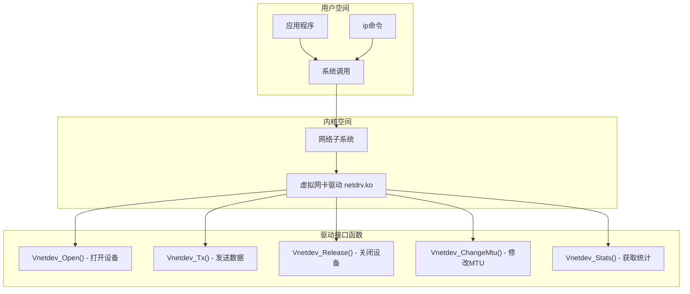

# 实验二：Linux 网络设备驱动开发实验

---

## 简要实验步骤

### 1. 环境准备

- 使用 VMware Ubuntu 虚拟机
- 安装内核头文件：`sudo apt install linux-headers-$(uname -r)`
- 安装编译工具：`sudo apt install build-essential gcc-12`

### 2. 程序设计

**驱动程序架构流程图：**



**驱动程序伪代码：**

```
// 模块初始化
module_init():
    printk("驱动加载中...")
    dev = alloc_netdev()
    dev->netdev_ops = &vnetdev_ops
    register_netdev(dev)

// 打开设备 (ip link set up)
Vnetdev_Open():
    printk("设备打开!")
    netif_start_queue(dev)

// 发送数据包
Vnetdev_Tx(skb, dev):
    printk("发送数据包, 长度: %d", skb->len)
    打印数据包内容
    dev_kfree_skb(skb)

// 修改MTU (ip link set mtu)
Vnetdev_ChangeMtu(dev, new_mtu):
    printk("MTU修改: %d -> %d", dev->mtu, new_mtu)
    dev->mtu = new_mtu
```

### 3. 编译运行

```bash
# 编译驱动
cd ~/Desktop/vnetdev
make clean
make

# 加载驱动
sudo insmod netdrv.ko
sudo ip link set vnet0 up

# 修改MTU触发
sudo ip link set vnet0 mtu 1222

# 查看内核打印
sudo dmesg | grep VNETDEV | tail -30

# 卸载驱动
sudo ip link set vnet0 down
sudo rmmod netdrv
```

---

## 实验结果

1. 成功编译并加载虚拟网卡驱动模块 `netdrv.ko`
2. 驱动加载时正确打印初始化信息和 MAC 地址
3. 使用 `ip link set vnet0 up` 成功触发 `Vnetdev_Open()` 函数
4. 系统自动发送数据包触发 `Vnetdev_Tx()` 函数，打印了发送的数据包内容
5. 使用 `ip link set vnet0 mtu 1222` 成功触发 `Vnetdev_ChangeMtu()` 函数
6. 驱动卸载时正确打印清理信息
7. 理解了驱动程序-操作系统-应用程序的三者联动机制

---

## 结果截图

> **（请在此处插入截图）**
>
> 截图命令：
>
> ```bash
> clear && echo "=== 网卡MAC地址 ===" && ip link show vnet0 | grep -E "vnet0|ether" && echo "" && echo "=== 驱动日志 ===" && sudo dmesg | grep VNETDEV | tail -30
> ```

【截图位置预留】

---

## 问题总结

### 遇到的问题

| 问题                                 | 原因                                               | 解决方案                                            |
| ------------------------------------ | -------------------------------------------------- | --------------------------------------------------- |
| `gcc-12: not found`                  | 内核用 gcc-12 编译，系统未安装                     | `sudo apt install gcc-12`                           |
| 编译报错 `incompatible pointer type` | Linux 6.x 内核 API 变化，`ndo_tx_timeout` 签名改变 | 更新驱动代码，添加 `unsigned int txqueue` 参数      |
| `ifconfig: command not found`        | 新版 Ubuntu 默认不安装 net-tools                   | 使用 `ip` 命令代替，或 `sudo apt install net-tools` |
| `dmesg: read kernel buffer failed`   | 需要 root 权限                                     | 使用 `sudo dmesg`                                   |
| VMware 共享文件夹 /mnt/hgfs 为空     | 未安装 VMware Tools                                | `sudo apt install open-vm-tools` 或手动挂载         |

### ifconfig 与 ip 命令对照

| 操作     | ifconfig (旧)                  | ip (新)                           |
| -------- | ------------------------------ | --------------------------------- |
| 启动网卡 | `sudo ifconfig vnet0 up`       | `sudo ip link set vnet0 up`       |
| 关闭网卡 | `sudo ifconfig vnet0 down`     | `sudo ip link set vnet0 down`     |
| 修改 MTU | `sudo ifconfig vnet0 mtu 1222` | `sudo ip link set vnet0 mtu 1222` |
| 查看网卡 | `ifconfig vnet0`               | `ip link show vnet0`              |

### 内核版本兼容性问题

Linux 6.x 内核相比旧版本有以下 API 变化：

| 旧 API                       | 新 API                         | 说明           |
| ---------------------------- | ------------------------------ | -------------- |
| `ndo_tx_timeout(dev)`        | `ndo_tx_timeout(dev, txqueue)` | 增加队列参数   |
| `ndo_get_stats()`            | `ndo_get_stats64()`            | 使用 64 位统计 |
| `memcpy(dev->dev_addr, mac)` | `eth_hw_addr_set(dev, mac)`    | 设置 MAC 地址  |

### 驱动-操作系统-应用程序联动

```
[用户执行 ip link set vnet0 up]
        |
        | 系统调用
        v
[内核网络子系统]
        |
        | 调用驱动接口
        v
[驱动 Vnetdev_Open()]
        |
        | printk() 打印
        v
[内核日志 dmesg]
```
