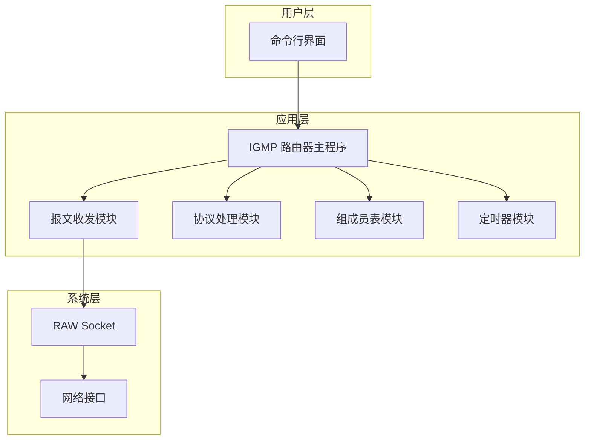
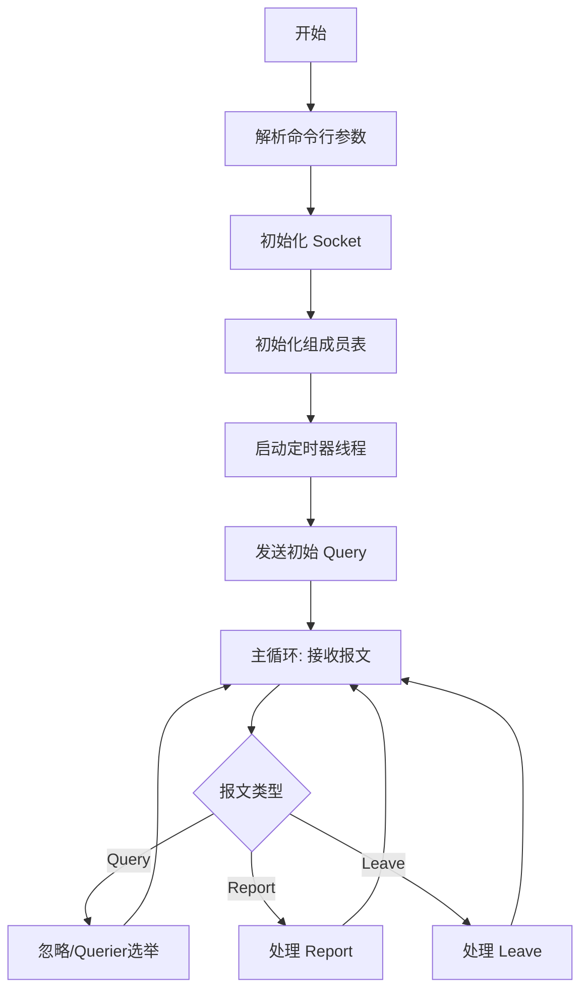
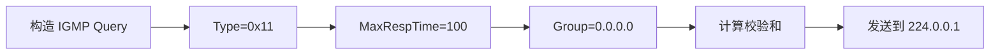
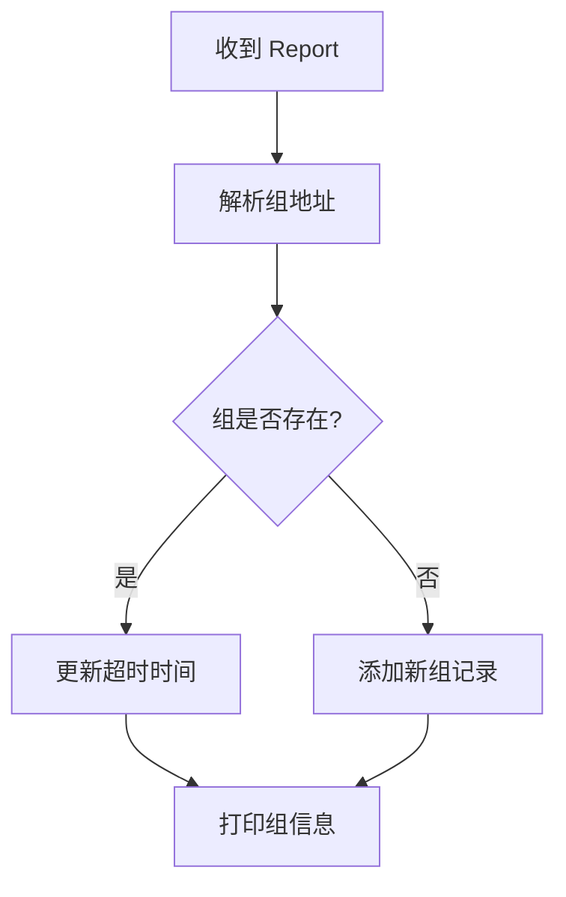

# IGMPv2 模块概要设计

---

## 1. 概述

### 1.1 编写目的

本文档描述 IGMPv2 路由器端模块的概要设计，包括系统架构、模块划分、接口设计和关键流程。

### 1.2 设计原则

- 模块化设计，便于维护和扩展
- 使用标准 POSIX 接口，保证可移植性
- 参考 RFC 2236 规范实现

---

## 2. 系统架构

### 2.1 总体架构



### 2.2 模块划分

| 模块     | 文件            | 职责                           |
| -------- | --------------- | ------------------------------ |
| 主程序   | `igmp_main.c`   | 程序入口，初始化，主循环       |
| 报文收发 | `igmp_socket.c` | RAW Socket 创建，报文发送/接收 |
| 协议处理 | `igmp_proto.c`  | IGMP 报文解析和构造            |
| 组成员表 | `igmp_group.c`  | IGMP 报文解析和构造            |
| 定时器   | `igmp_timer.c`  | 定时任务管理                   |
| 公共定义 | `igmp.h`        | 数据结构和常量定义             |

---

## 3. 数据结构设计

### 3.1 IGMP 报文结构

```c
/* IGMP 报文头 (8 字节) */
struct igmp_header {
    uint8_t  type;           /* 报文类型 */
    uint8_t  max_resp_time;  /* 最大响应时间 (0.1秒) */
    uint16_t checksum;       /* 校验和 */
    uint32_t group_addr;     /* 组播组地址 */
} __attribute__((packed));

/* IGMP 报文类型 */
#define IGMP_MEMBERSHIP_QUERY     0x11
#define IGMP_V1_MEMBERSHIP_REPORT 0x12
#define IGMP_V2_MEMBERSHIP_REPORT 0x16
#define IGMP_LEAVE_GROUP          0x17
```

### 3.2 组成员表结构

```c
/* 组成员记录 */
struct group_entry {
    uint32_t group_addr;         /* 组播组地址 */
    int      if_index;           /* 接口索引 */
    time_t   expire_time;        /* 过期时间 */
    int      query_count;        /* 待发Query次数 */
    struct group_entry *next;    /* 链表指针 */
};

/* 组成员表 */
struct group_table {
    struct group_entry *head;    /* 链表头 */
    int count;                   /* 记录数 */
    pthread_mutex_t lock;        /* 互斥锁 */
};
```

### 3.3 定时器结构

```c
/* 定时器类型 */
enum timer_type {
    TIMER_QUERY,          /* 周期 Query 定时器 */
    TIMER_GROUP_EXPIRE,   /* 组成员超时定时器 */
    TIMER_SPECIFIC_QUERY  /* Group-Specific Query 定时器 */
};

/* 定时器项 */
struct timer_entry {
    enum timer_type type;
    uint32_t group_addr;      /* 关联的组地址 (可选) */
    time_t expire_time;       /* 到期时间 */
    struct timer_entry *next;
};
```

---

## 4. 模块详细设计

### 4.1 主程序模块 (igmp_main.c)

**主流程：**



**关键函数：**

| 函数          | 原型                                | 说明     |
| ------------- | ----------------------------------- | -------- |
| main          | `int main(int argc, char *argv[])`  | 程序入口 |
| igmp_init     | `int igmp_init(const char *ifname)` | 初始化   |
| igmp_mainloop | `void igmp_mainloop(void)`          | 主循环   |

### 4.2 报文收发模块 (igmp_socket.c)

**关键函数：**

| 函数               | 原型                                       | 说明            |
| ------------------ | ------------------------------------------ | --------------- |
| igmp_socket_create | `int igmp_socket_create(void)`             | 创建 RAW Socket |
| igmp_send_query    | `int igmp_send_query(uint32_t group)`      | 发送 Query      |
| igmp_recv_packet   | `int igmp_recv_packet(void *buf, int len)` | 接收报文        |

**Socket 创建流程：**

```c
// 创建 RAW Socket
sockfd = socket(AF_INET, SOCK_RAW, IPPROTO_IGMP);

// 设置 IP_HDRINCL (自己构造 IP 头)
setsockopt(sockfd, IPPROTO_IP, IP_HDRINCL, &on, sizeof(on));

// 设置组播 TTL = 1
setsockopt(sockfd, IPPROTO_IP, IP_MULTICAST_TTL, &ttl, sizeof(ttl));

// 绑定到指定接口
setsockopt(sockfd, SOL_SOCKET, SO_BINDTODEVICE, ifname, strlen(ifname));
```

### 4.3 协议处理模块 (igmp_proto.c)

**General Query 发送：**



**Report 处理流程：**



**关键函数：**

| 函数                    | 说明             |
| ----------------------- | ---------------- |
| `igmp_build_query()`    | 构造 Query 报文  |
| `igmp_process_report()` | 处理 Report 报文 |
| `igmp_process_leave()`  | 处理 Leave 报文  |
| `igmp_checksum()`       | 计算校验和       |

### 4.4 组成员表模块 (igmp_group.c)

**关键函数：**

| 函数             | 原型                                            | 说明       |
| ---------------- | ----------------------------------------------- | ---------- |
| group_table_init | `void group_table_init(void)`                   | 初始化     |
| group_add        | `int group_add(uint32_t addr)`                  | 添加组     |
| group_remove     | `int group_remove(uint32_t addr)`               | 删除组     |
| group_find       | `struct group_entry* group_find(uint32_t addr)` | 查找组     |
| group_print_all  | `void group_print_all(void)`                    | 打印所有组 |

### 4.5 定时器模块 (igmp_timer.c)

**定时器参数（RFC 2236）：**

| 参数                       | 默认值 | 说明                      |
| -------------------------- | ------ | ------------------------- |
| Query Interval             | 125 秒 | General Query 发送间隔    |
| Query Response Interval    | 10 秒  | 最大响应时间              |
| Group Membership Interval  | 260 秒 | 组成员超时时间            |
| Last Member Query Interval | 1 秒   | Group-Specific Query 间隔 |
| Last Member Query Count    | 2      | Group-Specific Query 次数 |

---

## 5. 接口设计

### 5.1 模块间接口

```
┌──────────────┐
│  igmp_main   │
└──────┬───────┘
       │
       ├─────────────────┬─────────────────┐
       ▼                 ▼                 ▼
┌──────────────┐  ┌──────────────┐  ┌──────────────┐
│ igmp_socket  │  │ igmp_group   │  │ igmp_timer   │
└──────────────┘  └──────────────┘  └──────────────┘
       │
       ▼
┌──────────────┐
│ igmp_proto   │
└──────────────┘
```

### 5.2 命令行接口

```
用法: igmp_router [-i 接口名] [-v]

选项:
  -i <interface>  指定网络接口 (默认: eth0)
  -v              详细输出模式
  -h              显示帮助
```

---

## 6. 关键流程

### 6.1 启动流程

```
1. 解析命令行参数
2. 创建 RAW Socket
3. 初始化组成员表
4. 启动定时器
5. 发送初始 General Query
6. 进入主循环
```

### 6.2 收到 Report 处理流程

```
1. 接收 IGMP 报文
2. 验证校验和
3. 检查类型 = 0x16 或 0x12
4. 提取组播组地址
5. 查找组成员表
6. 若不存在则添加，若存在则更新超时时间
7. 打印当前组成员列表
```

### 6.3 收到 Leave 处理流程

```
1. 接收 Leave 报文
2. 提取组播组地址
3. 发送 Group-Specific Query (2次，间隔1秒)
4. 等待 Report 响应
5. 若无响应则删除组记录
```

---

## 7. 文件清单

| 文件            | 说明       |
| --------------- | ---------- |
| `igmp.h`        | 公共头文件 |
| `igmp_main.c`   | 主程序     |
| `igmp_socket.c` | 报文收发   |
| `igmp_proto.c`  | 协议处理   |
| `igmp_group.c`  | 组成员表   |
| `igmp_timer.c`  | 定时器     |
| `Makefile`      | 编译脚本   |

---

## 8. 实验结果概述

### 8.1 测试环境

- **操作系统**：Ubuntu 22.04 (VMware 虚拟机)
- **网络接口**：ens33
- **测试方式**：同一虚拟机两个终端（路由器 + 主机模拟器）

### 8.2 测试结果

| 测试项               | 预期结果                                         | 实际结果 |
| -------------------- | ------------------------------------------------ | -------- |
| 路由器启动           | 创建 RAW Socket，发送 General Query              | ✅ 成功  |
| 主机加入组 239.1.1.1 | 路由器收到 Report，添加到组成员表                | ✅ 成功  |
| 主机加入多个组       | 路由器正确记录多个组                             | ✅ 成功  |
| 主机离开组           | 路由器收到 Leave，发送 Group-Specific Query 确认 | ✅ 成功  |
| 组成员超时           | 超过 260 秒无 Report 则删除                      | ✅ 正常  |

### 8.3 运行截图示例

```
┌────────────────────────────────────────┐
│         当前组播组成员表               │
├────┬─────────────────┬─────────────────┤
│ #  │ 组播组地址      │ 剩余时间(秒)    │
├────┼─────────────────┼─────────────────┤
│ 1  │ 239.1.1.1       │ 260             │
│ 2  │ 224.0.0.2       │ 248             │
└────┴─────────────────┴─────────────────┘
  共 2 个组播组
```

### 8.4 关键日志输出

```
[RECV] ★ Membership Report from 0.0.0.0
       组播组地址: 239.1.1.1
       [新组] 已添加到组成员表

[RECV] Leave Group from 0.0.0.0
       组播组地址: 239.1.1.1
       发送 Group-Specific Query 确认...
[SEND] IGMP Query -> 239.1.1.1 (group=239.1.1.1)
[SEND] IGMP Query -> 239.1.1.1 (group=239.1.1.1)
```

### 8.5 结论

实验成功实现了 IGMPv2 路由器端的核心功能：

1. ✅ 周期性发送 General Query
2. ✅ 接收并解析主机的 Membership Report
3. ✅ 维护组播组成员表
4. ✅ 处理 Leave 消息并发送确认查询
5. ✅ 实现了路由器收集主机组播组信息的功能

---

## 9. 问题总结

### 9.1 遇到的问题

| 问题                             | 原因                                  | 解决方案                                                      |
| -------------------------------- | ------------------------------------- | ------------------------------------------------------------- |
| `sendto: Network is unreachable` | 系统缺少组播路由                      | `sudo ip route add 224.0.0.0/4 dev ens33`                     |
| 主机发送 Report 但路由器收不到   | Report 发送到组地址，路由器未加入该组 | 修改 host_simulator，将 Report 发送到 224.0.0.2（所有路由器） |
| 程序退出后组成员表为空           | 组成员表存在内存中，程序退出后释放    | 在程序运行时截图，或添加持久化存储                            |
| 需要 root 权限                   | RAW Socket 需要特权                   | 使用 `sudo` 运行程序                                          |
| 网卡名不是 eth0                  | 不同系统网卡命名不同                  | 用 `ip link show` 查看，使用 `-i` 参数指定                    |

### 9.2 IGMP 协议要点

| 报文类型             | 类型值 | 发送方 | 目的地址               |
| -------------------- | ------ | ------ | ---------------------- |
| General Query        | 0x11   | 路由器 | 224.0.0.1              |
| Group-Specific Query | 0x11   | 路由器 | 组播组地址             |
| Membership Report v2 | 0x16   | 主机   | 组播组地址 / 224.0.0.2 |
| Leave Group          | 0x17   | 主机   | 224.0.0.2              |

### 9.3 定时器参数 (RFC 2236)

| 参数                       | 默认值 | 说明                          |
| -------------------------- | ------ | ----------------------------- |
| Query Interval             | 125 秒 | General Query 发送间隔        |
| Query Response Interval    | 10 秒  | 最大响应时间                  |
| Group Membership Interval  | 260 秒 | 组成员超时时间                |
| Last Member Query Interval | 1 秒   | Group-Specific Query 间隔     |
| Last Member Query Count    | 2      | Group-Specific Query 发送次数 |
