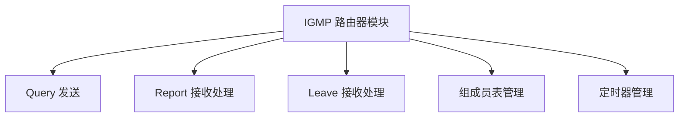

# IGMPv2 模块需求分析

---

## 1. 概述

### 1.1 编写目的

本文档描述 IGMPv2（Internet Group Management Protocol Version 2）路由器端模块的功能需求，为概要设计和编码实现提供依据。

### 1.2 适用范围

本模块适用于 Linux 环境下的组播路由器，实现路由器端的组播组成员管理功能。

### 1.3 参考资料

| 文档     | 说明                    |
| -------- | ----------------------- |
| RFC 2236 | IGMPv2 协议规范         |
| RFC 1112 | IGMPv1 协议规范         |
| RFC 3376 | IGMPv3 协议规范（参考） |

---

## 2. 协议背景

### 2.1 IGMP 协议简介

IGMP（Internet Group Management Protocol）是 IPv4 组播中用于管理主机与路由器之间组播组成员关系的协议。

```
┌─────────────┐    IGMP Query     ┌─────────────┐
│   组播      │ ───────────────── │             │
│   路由器    │                   │    主机     │
│  (Querier)  │ ◄───────────────  │  (Member)   │
└─────────────┘    IGMP Report    └─────────────┘
```

### 2.2 IGMPv2 报文类型

| 类型值 | 报文类型               | 发送方 | 说明       |
| ------ | ---------------------- | ------ | ---------- |
| 0x11   | Membership Query       | 路由器 | 查询组成员 |
| 0x16   | Membership Report (v2) | 主机   | 加入组播组 |
| 0x17   | Leave Group            | 主机   | 离开组播组 |
| 0x12   | Membership Report (v1) | 主机   | 兼容 v1    |

### 2.3 IGMPv2 报文格式

```
 0                   1                   2                   3
 0 1 2 3 4 5 6 7 8 9 0 1 2 3 4 5 6 7 8 9 0 1 2 3 4 5 6 7 8 9 0 1
+-+-+-+-+-+-+-+-+-+-+-+-+-+-+-+-+-+-+-+-+-+-+-+-+-+-+-+-+-+-+-+-+
|      Type     | Max Resp Time |           Checksum            |
+-+-+-+-+-+-+-+-+-+-+-+-+-+-+-+-+-+-+-+-+-+-+-+-+-+-+-+-+-+-+-+-+
|                         Group Address                         |
+-+-+-+-+-+-+-+-+-+-+-+-+-+-+-+-+-+-+-+-+-+-+-+-+-+-+-+-+-+-+-+-+

总长度：8 字节
```

| 字段          | 长度   | 说明                         |
| ------------- | ------ | ---------------------------- |
| Type          | 1 字节 | 报文类型                     |
| Max Resp Time | 1 字节 | 最大响应时间（单位：0.1 秒） |
| Checksum      | 2 字节 | 校验和                       |
| Group Address | 4 字节 | 组播组地址                   |

---

## 3. 功能需求

### 3.1 路由器端功能概述



### 3.2 详细功能需求

#### 3.2.1 General Query 发送

| 需求编号 | 需求描述                                    |
| -------- | ------------------------------------------- |
| REQ-001  | 周期性发送 General Query（默认间隔 125 秒） |
| REQ-002  | Query 目的地址为 224.0.0.1（所有主机）      |
| REQ-003  | Query 的 Group Address 字段为 0.0.0.0       |
| REQ-004  | Max Resp Time 默认设置为 100（10 秒）       |

#### 3.2.2 Group-Specific Query 发送

| 需求编号 | 需求描述                                   |
| -------- | ------------------------------------------ |
| REQ-005  | 收到 Leave 报文后发送 Group-Specific Query |
| REQ-006  | 目的地址为离开的组播组地址                 |
| REQ-007  | 发送次数为 2 次，间隔 1 秒                 |

#### 3.2.3 Report 接收处理

| 需求编号 | 需求描述                     |
| -------- | ---------------------------- |
| REQ-008  | 解析 IGMPv2 Report 报文      |
| REQ-009  | 兼容 IGMPv1 Report 报文      |
| REQ-010  | 更新组成员表，记录组播组地址 |
| REQ-011  | 重置该组的成员超时定时器     |

#### 3.2.4 Leave 接收处理

| 需求编号 | 需求描述                       |
| -------- | ------------------------------ |
| REQ-012  | 解析 Leave Group 报文          |
| REQ-013  | 发送 Group-Specific Query 确认 |
| REQ-014  | 超时无响应则删除组成员记录     |

#### 3.2.5 组成员表管理

| 需求编号 | 需求描述                          |
| -------- | --------------------------------- |
| REQ-015  | 维护组播组成员表                  |
| REQ-016  | 表项包含：组地址、接口、超时时间  |
| REQ-017  | 支持添加、删除、查询操作          |
| REQ-018  | 成员超时后自动删除（默认 260 秒） |

#### 3.2.6 定时器管理

| 需求编号 | 需求描述                                |
| -------- | --------------------------------------- |
| REQ-019  | Query 周期定时器（125 秒）              |
| REQ-020  | 组成员超时定时器（260 秒）              |
| REQ-021  | Group-Specific Query 重传定时器（1 秒） |

---

## 4. 接口需求

### 4.1 外部接口

| 接口       | 说明                                  |
| ---------- | ------------------------------------- |
| RAW Socket | 使用 IPPROTO_IGMP 发送/接收 IGMP 报文 |
| 网络接口   | 绑定到指定网卡（如 eth0）             |

### 4.2 数据结构

```c
// IGMP 报文结构
struct igmp_packet {
    uint8_t  type;           // 报文类型
    uint8_t  max_resp_time;  // 最大响应时间
    uint16_t checksum;       // 校验和
    uint32_t group_addr;     // 组播组地址
};

// 组成员表项
struct group_record {
    uint32_t group_addr;     // 组播组地址
    int      interface;      // 接口索引
    time_t   expire_time;    // 超时时间
    struct group_record *next;
};
```

---

## 5. 性能需求

| 需求         | 指标          |
| ------------ | ------------- |
| 组成员表容量 | 至少 100 个组 |
| 报文处理延迟 | < 100ms       |
| 内存占用     | < 1MB         |

---

## 6. 运行环境

| 项目     | 要求                         |
| -------- | ---------------------------- |
| 操作系统 | Linux (Ubuntu 20.04+)        |
| 编译器   | GCC 9.0+                     |
| 权限     | 需要 root 权限（RAW Socket） |
| 网络     | 至少一个网络接口             |
