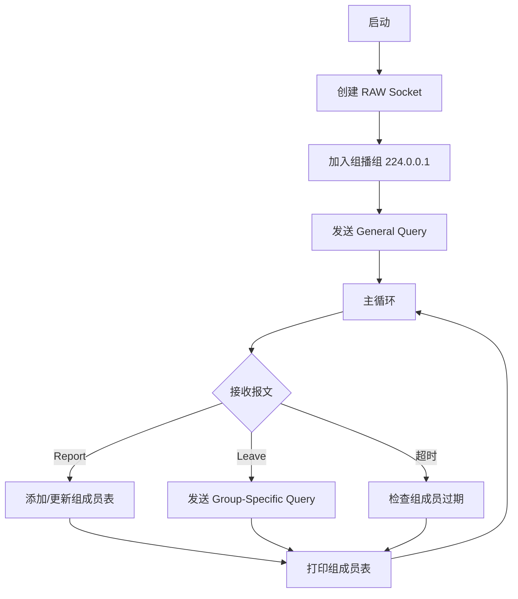

# 实验三：IGMP 协议软件（路由器端）开发

---

## 简要实验步骤

### 1. 环境准备

- 使用 VMware Ubuntu 虚拟机（需要两台或两个终端）
- 安装编译工具：`sudo apt install build-essential`

### 2. 程序设计

**IGMP 路由器架构流程图：**



**IGMP 路由器伪代码：**

```
main():
    socket = create_raw_socket(IPPROTO_IGMP)
    join_multicast(224.0.0.1)
    send_general_query()

    while running:
        packet = recv_igmp_packet()

        if packet.type == REPORT:
            group_add(packet.group_addr)
            print_group_table()

        if packet.type == LEAVE:
            send_group_specific_query(packet.group_addr)

        check_group_expire()
```

### 3. 编译运行

```bash
# 编译
cd code/
make

# 虚拟机1 运行路由器
sudo ./igmp_router -i eth0 -v

# 虚拟机2 运行主机模拟器
sudo ./host_simulator
# 然后输入: join 239.1.1.1
```

---

## 实验结果

1. 成功编译 IGMP 路由器程序
2. 路由器正确发送 General Query 到 224.0.0.1
3. 收到主机 Report 后，正确添加到组成员表
4. 收到 Leave 后，发送 Group-Specific Query 确认
5. 组成员超时后自动删除
6. 实现了路由器收集主机组播组信息的功能

---

## 结果截图

> **（请在此处插入截图）**
>
> 截图要求：
>
> - 包含路由器收集到的组播组成员表
> - 包含 MAC 地址信息（`ip link show eth0 | grep ether`）
> - 以上内容需在同一张屏幕截图中

【截图位置预留】

---

## 问题总结

### 遇到的问题

| 问题               | 原因                | 解决方案                                   |
| ------------------ | ------------------- | ------------------------------------------ |
| 需要 root 权限     | RAW Socket 需要特权 | 使用 `sudo` 运行                           |
| 网卡名不是 eth0    | 不同系统网卡名不同  | 用 `ip link show` 查看，使用 `-i` 参数指定 |
| 两台虚拟机通信不了 | 网络配置问题        | 确保都是桥接模式或同一 NAT 网络            |

### IGMP 协议要点

| 报文类型             | 类型值 | 发送方 | 目的地址  |
| -------------------- | ------ | ------ | --------- |
| General Query        | 0x11   | 路由器 | 224.0.0.1 |
| Group-Specific Query | 0x11   | 路由器 | 组地址    |
| Membership Report    | 0x16   | 主机   | 组地址    |
| Leave Group          | 0x17   | 主机   | 224.0.0.2 |

### 定时器参数 (RFC 2236)

| 参数                      | 默认值 | 说明                   |
| ------------------------- | ------ | ---------------------- |
| Query Interval            | 125 秒 | General Query 发送间隔 |
| Query Response Interval   | 10 秒  | 最大响应时间           |
| Group Membership Interval | 260 秒 | 组成员超时时间         |
